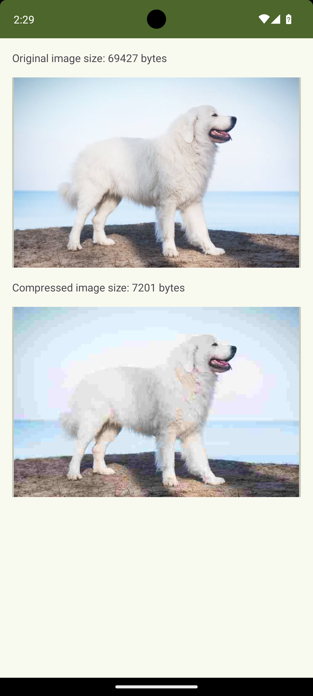

# My Awesome Android App

Welcome to **Jpeg Compressor App**! This application is designed to help you manage your images and their size.

## Features

- Easy to choose images from ChooseActivity
- User-friendly design to compress your image in EditActivity
- Clear result review in ReviewActivity

## Screenshots

Here are some screenshots of the app in action:

  
  
  

## Video Demo

Check out the following video to see the app in action:

[Watch the video](https://streamable.com/63i3ow)
